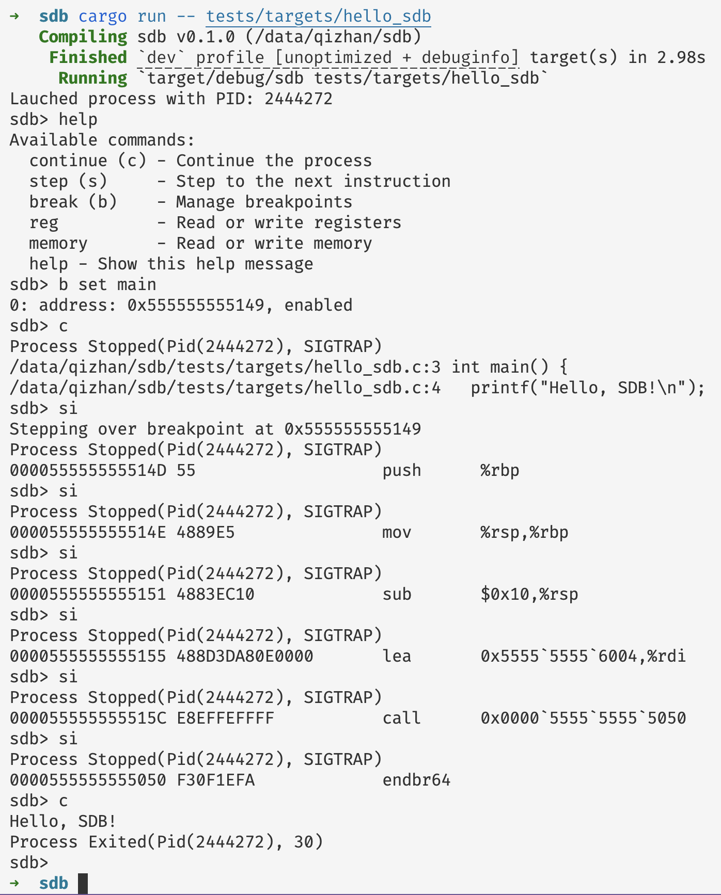

# Simple Debugger in Rust

This is a simple X86-64 debugger written for learning purposes. Following the awesome book 《building a debugger write a native x64 debugger from scratch》in C++, I write this in Rust to understand how debuggers work.

Interesting part to me:

- Use `ptrace` system call based on `nix` crate to attach to a process and control its execution.
- The *hacky* implementation of `breakpoint` by replacing the instruction.
- Use `iced-x86` crate to disassemble the instruction, which is suprisingly easy to use.
- Use DWARF to support source level debugging.
- ...

See the following screenshots for the current status of the debugger.

